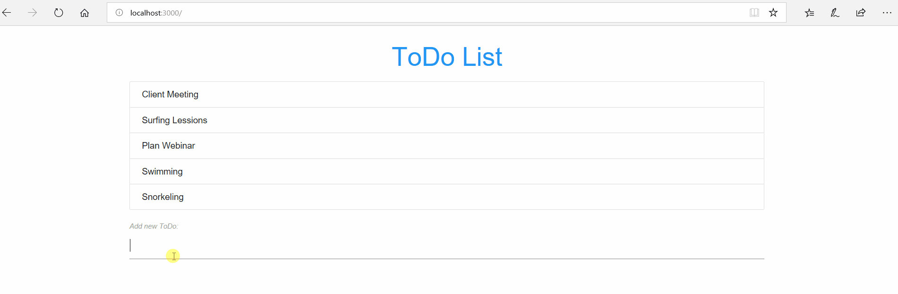

# React Simple ToDo Application



## Installation

```bash
# Package Installation
npm install

# Run the Project
npm start

# Project Build
npm run build
```

## Folder Structure

```bash
+-- src
  +-- AddTodo.js
  +-- App.js
  +-- App.test.js
  +-- index.css
  +-- index.js
  +-- Todos.js
```
